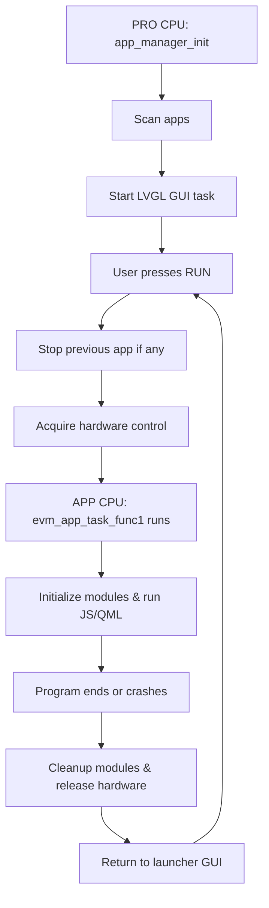

# EVM Launcher for ESP32 - سیستم عامل سبک با ماشین مجازی جاوااسکریپت

## 📋 فهرست مطالب

- [مقدمه](#مقدمه)
- [ویژگی‌ها](#ویژگیها)
- [معماری سیستم](#معماری-سیستم)
- [ماژول‌های EVM](#ماژولهای-evm)
- [نصب و راه‌اندازی](#نصب-و-راهاندازی)
- [استفاده](#استفاده)
- [مستندات API](#مستندات-api)
- [مثال‌ها](#مثالها)
- [عیب‌یابی](#عیبیابی)

## 🚀 مقدمه

**EVM Launcher** یک سیستم عامل سبک برای ESP32 است که امکان اجرای برنامه‌های JavaScript و QML را از روی کارت حافظه فراهم می‌کند. این سیستم از یک ماشین مجازی (EVM) برای اجرای امن برنامه‌ها استفاده می‌کند.

### معماری پیشرفته Dual-Core

```
[SD Card] ←→ [ESP32] ←→ [LCD + دکمه‌ها]
     ↓              ↓
   برنامه‌های      EVM Core
   JavaScript     (MuJS Engine)
     ↓
   اجرا در PSRAM
   با ماژول‌های سیستم
```

امرحله‌به‌مرحله توضیح میدم:
۱. جریان کلی اجرا بین APP Manager و EVM Loader

1. راه‌اندازی Application Manager (PRO CPU)

   * app_manager_init() در پروسِس CPU اجرا می‌شود.

   * Shared hardware (shared_hardware_init) و EVM Loader Core (evm_loader_core_init) راه‌اندازی می‌شوند.

   * GPIO دکمه‌ها و LVGL Semaphore ساخته می‌شوند.

   * این مرحله روی PRO CPU انجام می‌شود، CPU0 یا Core0.

2. شروع UI LVGL (PRO CPU)

   * app_manager_start_ui() تسک GUI را روی Core0 ایجاد می‌کند (guiTask).

   * Display bufferها تخصیص داده می‌شوند.

   * صفحه لانچر ایجاد می‌شود (create_lvgl_ui()).

   * Semaphore برای محافظت از دسترسی همزمان GUI و دکمه‌ها ایجاد می‌شود.

3. Scan برنامه‌ها

   * app_manager_scan() فایل‌های .js, .qml, .evm روی SD کارت اسکن می‌شوند.

   * اطلاعات هر برنامه شامل مسیر، نام، نوع، و سایز فایل ذخیره می‌شود.

4. انتخاب و اجرای برنامه (APP CPU)

   * وقتی کاربر روی دکمه RUN می‌زند، app_manager_launch_evm_app(index) فراخوانی می‌شود.

   * اگر برنامه‌ای در حال اجراست، ابتدا evm_stop_app() اجرا می‌شود و یک تاخیر کوتاه اعمال می‌شود.

   * سپس صفحه اپ (evm_lvgl_set_app_screen()) بارگذاری می‌شود و evm_launch_app() صدا زده می‌شود.

   * تسک برنامه روی APP CPU (Core1) اجرا می‌شود.

5. تسک EVM Loader روی APP CPU

   * evm_app_task_func() (یا evm_app_task_func1() که ساده‌تر است) تسک را اجرا می‌کند.

   * کنترل سخت‌افزار گرفته می‌شود (shared_hardware_acquire_control).

   * ماژول‌های EVM راه‌اندازی می‌شوند (safe_evm_modules_init()).

   * برنامه JS یا QML اجرا می‌شود (evm_load_and_execute()).

   * در پایان برنامه، پاکسازی ماژول‌ها و آزادسازی سخت‌افزار انجام می‌شود.

   * تسک vTaskDelete(NULL) می‌شود و APP CPU آماده اجرای برنامه بعدی است.


   * همه دسترسی‌ها به LVGL با xSemaphoreTake(xGuiSemaphore) محافظت شوند.

   * از delayهای کوتاه و معقول استفاده شود تا deadlock رخ ندهد.

۴. پیشنهاد جریان اصلاح‌شده




## ✨ ویژگی‌ها

🔄 مقایسه جاوا متور با یکدیگر موتورها
موتور	سایز	ES Support	Performance	استفاده
Duktape	~300KB	ES5-ES6	خوب	Embedded, IoT
MuJS	~200KB	ES5	متوسط	Embedded
QuickJS	~400KB	ES2020	عالی	IoT, Embedded
JerryScript	~200KB	ES5.1	خوب	دستگاه‌های محدود


### ویژگی‌های اصلی

- **ماشین مجازی JavaScript**: اجرای برنامه‌های JS با موتور MuJS
- **مدیریت برنامه‌ها**: اسکن خودکار و مدیریت برنامه‌های نصب شده
- **رابط کاربری گرافیکی**: رابط کاربری زیبا با LVGL 7
- **پشتیبانی از سخت‌افزار**:
  - LCD نمایشگر 160x128
  - کارت حافظه SD
  - دکمه‌های فیزیکی (UP, DOWN, SELECT, BACK)
  - GPIO، تایمر، ADC، PWM
- **سیستم ماژولار**: ماژول‌های قابل گسترش برای قابلیت‌های مختلف

### معماری سیستم

- **هسته 0 (PRO CPU)**: لانچر اصلی و رابط کاربری
- **هسته 1 (APP CPU)**: اجرای برنامه‌های EVM
- **مدیریت منابع مشترک**: LCD، SD Card، دکمه‌ها

## 🏗️ معماری سیستم

### کامپوننت‌های اصلی

```
elf_launcher/
├── 📁 main/
│   ├── 📄 main.c                          # نقطه شروع سیستم
├── 📁 components/
│   ├── 📁 app_manager/                  # مدیریت برنامه‌های EVM 
│   ├── 📁 evm_loader/                    # لودر EVM و JavaScript  # مدیریت دو هسته‌ای
│   ├── 📁 hardware_manager/              # مدیریت سخت‌افزار
│   ├── 📁 shared_hardware/               # مدیریت منابع مشترک
│   ├── 📁 lvgl/                          # کتابخانه گرافیکی LVGL 7
│   ├── 📁 mujs/                          # موتور JavaScript MuJS
│   └── 📁 evm_modules/                   # ماژول‌های EVM
```


components/
├── hardware_manager/
│   ├── hardware_manager.h
│   ├── hardware_manager.c
│   └── CMakeLists.txt
├── wifi_driver/
│   ├── wifi_driver.h
│   ├── wifi_driver.c
│   └── CMakeLists.txt
└── evm_modules/
    ├── evm_module_wifi.h
    ├── evm_module_wifi.c
    └── CMakeLists.txt


├── 📁 components/mongoose
├── mqtt_broker.c / mqtt_broker.h
├── mqtt_client.c / mqtt_client.h  
├── ftp_server.c / ftp_server.h
├── http_server.c / http_server.h
├── websocket_server.c / websocket_server.h
└── main.c

## 📦 ماژول‌های EVM

تغییرات اصلی در ارتقا به LVGL v8:


۱. APIهای ساده‌تر:

    lv_obj_create(parent, NULL) → lv_obj_create(parent)

    lv_label_create(parent, NULL) → lv_label_create(parent)

۲. سیستم استایل جدید:

    lv_obj_set_style_local_bg_color(obj, part, state, color) → lv_obj_set_style_bg_color(obj, color, selector)

    LV_OBJ_PART_MAIN → LV_PART_MAIN

۳. ثابت‌های جدید:

    LV_ALIGN_IN_TOP_LEFT → LV_ALIGN_TOP_LEFT

    LV_LABEL_ALIGN_LEFT → LV_TEXT_ALIGN_LEFT

۴. ویجت‌های جدید:

    lv_switch_create()

    lv_slider_create()

۵. مدیریت وضعیت جدید:

    lv_obj_add_state()

    lv_obj_clear_state()


تغیرات انجام شده در اپ منجر تغییرات اصلی انجام شده:

    LVGL v8 Display Buffer:

        lv_disp_buf_t → lv_disp_draw_buf_t

        lv_disp_buf_init() → lv_disp_draw_buf_init()

        disp_drv.buffer → disp_drv.draw_buf

    ایجاد آبجکت‌ها:

        lv_obj_create(parent, NULL) → lv_obj_create(parent)

        lv_label_create(parent, NULL) → lv_label_create(parent)

    استایل‌ها:

        lv_obj_set_style_local_*() → lv_obj_set_style_*()

        استفاده از LV_PART_MAIN | LV_STATE_DEFAULT

    Alignment:

        lv_obj_align(obj, NULL, LV_ALIGN_IN_TOP_LEFT, x, y) → lv_obj_align(obj, LV_ALIGN_TOP_LEFT, x, y)

    Format Specifiers:

        استفاده از PRIu32 برای متغیرهای uint32_t

        اضافه کردن #include <inttypes.h>

    Constants:

        تعریف constants جدید برای سازگاری با LVGL v8


### ماژول‌های موجود

| ماژول | وضعیت | توضیحات |
|-------|--------|----------|
| `evm_module_gpio` | ✅ فعال | کنترل پین‌های GPIO |
| `evm_module_timer` | ✅ فعال | مدیریت تایمر و تاخیر |
| `evm_module_fs` | ✅ فعال | سیستم فایل و مدیریت فایل |
| `evm_module_process` | ✅ فعال | مدیریت پردازش و سیستم |
| `evm_module_console` | ✅ فعال | کنسول و لاگ‌گیری |
| `evm_module_lvgl` | ✅ فعال | رابط گرافیکی LVGL |

### ماژول‌های در حال توسعه

| ماژول | وضعیت | اولویت |
|-------|--------|---------|
| `evm_module_adc` | 🚧 توسعه | بالا |
| `evm_module_pwm` | 🚧 توسعه | بالا |
| `evm_module_i2c` | 🚧 توسعه | متوسط |
| `evm_module_uart` | 🚧 توسعه | متوسط |
| `evm_module_network` | 📅 برنامه‌ریزی | پایین |
| `evm_module_audio` | 📅 برنامه‌ریزی | پایین |

## 🔧 نصب و راه‌اندازی

### پیش‌نیازها

- **ESP-IDF** نسخه ۴.۴ یا بالاتر
- **Python** نسخه ۳.۸ یا بالاتر
- **ESP32** با پشتیبانی از SD Card و PSRAM
- **کارت حافظه** فرمت شده با FAT32

### کامپایل و فلش

```bash
# کلون کردن پروژه
git clone https://github.com/your-username/evm_launcher.git
cd evm_launcher

# تنظیم تارگت
idf.py set-target esp32

# ساخت پروژه
idf.py build

# فلش روی دستگاه
idf.py flash

# مانیتور سریال
idf.py monitor
```

### پیکربندی سخت‌افزار

#### اتصالات SD Card

| پین ESP32 | اتصال SD Card |
|-----------|---------------|
| GPIO 18   | CLK           |
| GPIO 19   | MOSI          |
| GPIO 23   | MISO          |
| GPIO 5    | CS            |
| 3.3V      | VCC           |
| GND       | GND           |

#### اتصالات LCD

| پین ESP32 | اتصال LCD |
|-----------|-----------|
| GPIO 15   | CS        |
| GPIO 13   | DIN       |
| GPIO 14   | CLK       |

#### دکمه‌ها

| پین ESP32 | کاربرد دکمه |
|-----------|-------------|
| GPIO 2    | UP          |
| GPIO 4    | SELECT      |
| GPIO 34   | DOWN        |
| GPIO 35   | BACK        |

## 📖 استفاده

### آماده‌سازی کارت حافظه

1. کارت حافظه را با فرمت FAT32 فرمت کنید
2. پوشه `apps` را در روت ایجاد کنید
3. فایل‌های JavaScript را در پوشه `apps` قرار دهید

```
/sdcard/
└── apps/
    ├── media_player.js
    ├── game_pong.js
    ├── settings.js
    └── clock.js
```

### اجرای لانچر

1. دستگاه را روشن کنید
2. لانچر به طور خودکار اجرا می‌شود
3. برنامه‌های موجود را با دکمه‌ها انتخاب کنید
4. دکمه SELECT را برای اجرا فشار دهید

### کنترل‌ها

- **UP**: حرکت به بالا در لیست
- **DOWN**: حرکت به پایین در لیست  
- **SELECT**: اجرای برنامه انتخاب شده
- **BACK**: توقف برنامه و بازگشت به لانچر

## 🎯 ماژول‌های EVM - مستندات API

### ماژول GPIO (`evm_module_gpio`)

```javascript
// تنظیم پین به عنوان خروجی
GPIO.setMode(2, "output");

// نوشتن مقدار به پین
GPIO.write(2, 1);

// خواندن مقدار از پین
let value = GPIO.read(4);

// تنظیم پین به عنوان ورودی با pull-up
GPIO.setMode(4, "input_pullup");
```

### ماژول تایمر (`evm_module_timer`)

```javascript
// تاخیر به میلی‌ثانیه
Timer.delay(1000);

// دریافت زمان سیستم
let time = Timer.getTime();

// ایجاد تایمر دوره‌ای
let timerId = Timer.setInterval(function() {
    print("Tick");
}, 1000);

// توقف تایمر
Timer.clearInterval(timerId);
```

### ماژول سیستم فایل (`evm_module_fs`)

```javascript
// خواندن فایل
let content = FS.readFile("/sdcard/data.txt");

// نوشتن در فایل
FS.writeFile("/sdcard/data.txt", "Hello World");

// بررسی وجود فایل
if (FS.exists("/sdcard/data.txt")) {
    print("File exists");
}

// لیست فایل‌های دایرکتوری
let files = FS.readDir("/sdcard/apps");
```

### ماژول پردازش (`evm_module_process`)

```javascript
// اطلاعات سیستم
let info = Process.getSystemInfo();
print("Free RAM: " + info.freeRam);

// خروج از برنامه
Process.exit();

// اجرای دستور سیستم
Process.execute("ls /sdcard");
```

### ماژول کنسول (`evm_module_console`)

```javascript
// چاپ در کنسول
Console.log("This is a log message");
Console.warn("This is a warning");
Console.error("This is an error");

// قالب‌بندی متن
Console.log("Value: %d, Name: %s", 42, "test");
```

### ماژول LVGL (`evm_module_lvgl`)

```javascript
// ایجاد label
let label = LVGL.createLabel("Hello World");
LVGL.setPosition(label, 50, 50);

// ایجاد دکمه
let btn = LVGL.createButton("Click Me");
LVGL.setSize(btn, 100, 40);

// تنظیم رویداد کلیک
LVGL.setOnClick(btn, function() {
    print("Button clicked!");
});

// ایجاد صفحه
let screen = LVGL.createScreen();
LVGL.setBackgroundColor(screen, 0x0000FF);
```

## 💡 مثال‌ها

### مثال ۱: برنامه ساده

```javascript
// simple_app.js
print("=== Simple EVM Application ===");
print("Hello from EVM Launcher!");

let info = Process.getSystemInfo();
print("Free RAM: " + info.freeRam + " bytes");

for(let i = 0; i < 5; i++) {
    print("Counting: " + i);
    Timer.delay(1000);
}

print("=== Application Finished ===");
```

### مثال ۲: برنامه با GPIO

```javascript
// blink_led.js
print("=== LED Blink Example ===");

// تنظیم پین LED به عنوان خروجی
GPIO.setMode(2, "output");

let state = 0;
for(let i = 0; i < 10; i++) {
    state = 1 - state; // toggle state
    GPIO.write(2, state);
    print("LED: " + (state ? "ON" : "OFF"));
    Timer.delay(500);
}

print("=== Blink Finished ===");
```

### مثال ۳: برنامه با رابط کاربری

```javascript
// gui_app.js
print("=== GUI Application ===");

// ایجاد رابط کاربری ساده
let screen = LVGL.createScreen();
LVGL.setBackgroundColor(screen, 0x2D3250);

let label = LVGL.createLabel("Hello EVM GUI!");
LVGL.setPosition(label, 30, 40);
LVGL.setTextColor(label, 0xFFFFFF);

let button = LVGL.createButton("Click Me!");
LVGL.setPosition(button, 40, 80);
LVGL.setSize(button, 80, 30);

LVGL.setOnClick(button, function() {
    print("Button was clicked!");
    LVGL.setText(label, "Button Clicked!");
});

print("GUI application running...");

// حلقه اصلی
let counter = 0;
Timer.setInterval(function() {
    counter++;
    LVGL.setText(button, "Count: " + counter);
}, 1000);
```

### مثال ۴: کار با فایل سیستم

```javascript
// file_manager.js
print("=== File Manager ===");

// لیست برنامه‌ها
let apps = FS.readDir("/sdcard/apps");
print("Found " + apps.length + " applications:");

for(let i = 0; i < apps.length; i++) {
    print("  " + (i+1) + ". " + apps[i]);
}

// ایجاد فایل log
FS.writeFile("/sdcard/log.txt", "Application started at: " + Timer.getTime());

print("=== File operations completed ===");
```

این ماژول JSON کامل شامل:

✅ توابع اصلی: parse, stringify, stringifyPretty, isValid
✅ توابع پیشرفته: merge, get, type, keys, values, length
✅ ابزارها: minify, escape

همه توابع با استفاده از cJSON پیاده‌سازی شده‌اند و کاملاً پایدار هستند.

 EVM Launcher برای ESP32 هستند. همچنین ایده‌هایی برای بهبود مدیریت حافظه LVGL با استفاده از zmalloc (از Redis) مطرح شده است.

هدف اصلی: بهبود مدیریت حافظه در LVGL با استفاده از ایده‌های zmalloc و ردیابی دقیق مصرف حافظه.

ما باید سیستم مدیریت آبجکت LVGL را با ویژگی‌های زیر پیاده‌سازی کنیم:

    ردیابی مصرف حافظه هر آبجکت

    ایمنی رشته‌ای (برای محیط چند هسته‌ای)

    تشخیص نشت حافظه

    گزارش‌دهی وضعیت حافظه

از آنجایی که کدهای موجود از یک سیستم مدیریت ساده برای آبجکت‌های LVGL استفاده می‌کنند (آرایه app_objects و app_object_count)، ما می‌توانیم این سیستم را با سیستم پیشرفته‌تری جایگزین کنیم.

پیشنهادات اجرایی:

    ایجاد یک ساختار مدیریت آبجکت LVGL که شامل اطلاعات نوع آبجکت، مصرف حافظه و وضعیت مدیریت باشد.

    استفاده از zmalloc برای تخصیص حافظه و ردیابی مصرف.

    اضافه کردن قابلیت‌های ایمنی رشته‌ای با استفاده از mutex.

    اضافه کردن توابع گزارش‌دهی و تشخیص نشت حافظه.

ما این تغییرات را در ماژول LVGL اعمال خواهیم کرد. از آنجایی که کدهای موجود از ماژول‌های EVM استفاده می‌کنند، باید مطمئن شویم که تغییرات با معماری موجود سازگار هستند.

بیایید شروع کنیم با تعریف ساختارها و توابع جدید در evm_module_lvgl.h و evm_module_lvgl.c (که در اینجا ارائه نشده اما می‌توانیم فرض کنیم که وجود دارد).

ما باید توابع زیر را اضافه کنیم:

    lvgl_register_object: برای ثبت آبجکت در سیستم مدیریت حافظه

    lvgl_safe_cleanup: برای پاک‌سازی ایمن آبجکت‌ها

    lvgl_memory_report: برای گزارش وضعیت حافظه

    lvgl_leak_detection: برای تشخیص نشت حافظه

همچنین باید توابع ایجاد آبجکت LVGL را تغییر دهیم تا از سیستم جدید استفاده کنند.

از آنجایی که کدهای موجود از یک آرایه ساده برای مدیریت آبجکت‌ها استفاده می‌کنند، ما این آرایه را با یک ساختار پویا جایگزین می‌کنیم که از zmalloc استفاده می‌کند.

توجه: ما از zmalloc که در EVM استفاده می‌شود، بهره می‌بریم. فرض می‌کنیم که zmalloc در پروژه موجود است.

ما تغییرات را به صورت زیر اعمال می‌کنیم:

    در evm_module_lvgl.h، ساختارها و توابع جدید را تعریف می‌کنیم.

    در evm_module_lvgl.c، توابع جدید را پیاده‌سازی می‌کنیم.

    توابع موجود در evm_module_lvgl.c را تغییر می‌دهیم تا از سیستم جدید استفاده کنند.

    در evm_loader.h و evm_loader.c، توابع توقف برنامه را به روز می‌کنیم تا از سیستم جدید برای پاک‌سازی استفاده کنند.

از آنجایی که فایل evm_loader.h و evm_loader.c بزرگ هستند، ما فقط قسمت‌های مربوطه را تغییر می‌دهیم.

بیایید با تغییرات در evm_module_lvgl.h شروع کنیم.

بر اساس کدهای شما و ایده‌های ارائه شده، یک سیستم مدیریت حافظه پیشرفته برای LVGL طراحی می‌کنم. این سیستم از zmalloc الهام گرفته و مشکلات فعلی شما را حل می‌کند:


 evm_loader منتقل کنیم.

برای ماژول گرافیک (evm_module_lvgl):

    تمام کدهای مربوط به LVGL را در یک فایل نگه می داریم

    توابع مدیریت حافظه را به evm_loader منتقل می کنیم

    از ماکروهای ثبت خودکار استفاده می کنیم

برای evm_loader:

    توابع مدیریت حافظه پیشرفته را اضافه می کنیم

    از zmalloc برای ردیابی حافظه استفاده می کنیم

    سیستم مدیریت آبجکت های LVGL را یکپارچه می کنیم

این رویکرد مزایای زیر را دارد:

    ماژول گرافیک متمرکز و تمیز

    مدیریت حافظه یکپارچه در لودر

    استفاده از قابلیت های پیشرفته zmalloc

    ردیابی بهتر و گزارش گیری حافظه


## 🐛 عیب‌یابی

### مشکلات متداول

#### برنامه‌ها پیدا نمی‌شوند

- مطمئن شوید پوشه `apps` در روت SD Card وجود دارد
- فایل‌ها باید پسوند `.js` داشته باشند
- کارت حافظه باید با فرمت FAT32 فرمت شده باشد

#### خطای حافظه

```
E (1234) evm_loader: Not enough memory
```

- برنامه JavaScript بسیار بزرگ است
- حافظه PSRAM کافی نیست
- برنامه‌های دیگر را ببندید

#### خطای اجرای JavaScript

```
E (5678) evm_loader: JavaScript execution failed
```

- سینتکس JavaScript معتبر نیست
- توابع یا ماژول‌های تعریف نشده فراخوانی شده‌اند

### لاگ‌گیری

لاگ‌های سیستم را با دستور زیر مشاهده کنید:

```bash
idf.py monitor
```

### تست سخت‌افزار

برای تست سخت‌افزار از برنامه تست استفاده کنید:

```javascript
// hardware_test.js
print("=== Hardware Test ===");

// تست GPIO
GPIO.setMode(2, "output");
for(let i = 0; i < 3; i++) {
    GPIO.write(2, 1);
    Timer.delay(200);
    GPIO.write(2, 0);
    Timer.delay(200);
}

// تست فایل سیستم
FS.writeFile("/sdcard/test.txt", "Test successful");
let content = FS.readFile("/sdcard/test.txt");
print("File test: " + content);

print("=== Hardware Test Completed ===");
```

## 🔄 گردش کار توسعه

### افزودن ماژول جدید

1. ایجاد فایل‌های ماژول در `evm_modules/`
2. ثبت ماژول در `evm_loader.c`
3. اضافه کردن توابع JavaScript
4. تست ماژول

### ساختار ماژول نمونه

```c
// evm_module_example.c
#include "evm_module.h"

static int example_hello(js_State *J) {
    const char* name = js_tostring(J, 1);
    printf("Hello %s!\n", name);
    js_pushundefined(J);
    return 1;
}

static void example_register(js_State *J) {
    js_newobject(J);
    js_newcfunction(J, example_hello, "hello", 1);
    js_setproperty(J, -2, "hello");
}

esp_err_t evm_example_init(void) {
    return evm_module_register_js_function(example_register, "Example");
}
```

## 🚀 نقشه راه

### نسخه ۱.۰ (فعلی)
- ✅ اجرای برنامه‌های JavaScript
- ✅ رابط کاربری گرافیکی
- ✅ ماژول‌های پایه (GPIO, Timer, FS, Console, Process, LVGL)

### نسخه ۱.۱ (آتی)
- 🚧 ماژول‌های سخت‌افزار (ADC, PWM, I2C, UART)
- 🚧 بهینه‌سازی عملکرد
- 🚧 مدیریت حافظه پیشرفته

### نسخه ۲.۰ (بلند مدت)
- 📅 پشتیبانی از QML
- 📅 ماژول شبکه
- 📅 سیستم پکیج مدیریت

---

**توسعه داده شده با ❤️ برای جامعه ESP32**


برای استفاده از  دیکودر های تصویر استفاده از  \ی اس رم

/*1: use custom malloc/free, 0: use the built-in `lv_mem_alloc()` and `lv_mem_free()`*/

#define LV_MEM_CUSTOM 1
#if LV_MEM_CUSTOM == 1
    #define LV_MEM_CUSTOM_INCLUDE "esp_heap_caps.h"   /*Header for the dynamic memory function*/
    

    #define LV_MEM_CUSTOM_ALLOC(size) heap_caps_malloc(size, MALLOC_CAP_8BIT)
    #define LV_MEM_CUSTOM_FREE(ptr) heap_caps_free(ptr)
    #define LV_MEM_CUSTOM_REALLOC(ptr, new_size) heap_caps_realloc(ptr, new_size, MALLOC_CAP_8BIT)
    


#else       /*LV_MEM_CUSTOM*/
    #define LV_MEM_CUSTOM_INCLUDE <stdlib.h>   /*Header for the dynamic memory function*/
    #define LV_MEM_CUSTOM_ALLOC   malloc
    #define LV_MEM_CUSTOM_FREE    free
    #define LV_MEM_CUSTOM_REALLOC realloc
#endif     /*LV_MEM_CUSTOM*/


## 1. `lvgl` — صفحه‌نمایش (LVGL v7)
```js
lvgl.obj_create()           → آبجکت پایه
lvgl.obj_set_size(obj, w, h) → اندازه
lvgl.obj_set_pos(obj, x, y)  → موقعیت
lvgl.obj_align(obj, base, align, x, y) → تراز
lvgl.obj_align_simple(obj, align, x, y) → تراز ساده
lvgl.obj_del(obj)            → حذف

lvgl.label_create()          → لیبل
lvgl.label_set_text(l, "متن") → متن
lvgl.label_set_align(l, lvgl.LABEL_ALIGN_CENTER)

lvgl.btn_create()            → دکمه
lvgl.btn_set_state(btn, lvgl.BTN_STATE_PR)

lvgl.img_create()            → عکس
lvgl.img_set_src(img, "/sdcard/icon.bin")

lvgl.bar_create()            → نوار پیشرفت
lvgl.bar_set_value(bar, 75, lvgl.ANIM_ON)
lvgl.bar_set_range(bar, 0, 100)

lvgl.scr_act()               → صفحه فعلی
lvgl.disp_get_hor_res()      → عرض صفحه
lvgl.disp_get_ver_res()      → ارتفاع صفحه

lvgl.cleanup_app()           → پاک کردن همه
lvgl.advanced_cleanup()      → پاک‌سازی پیشرفته
lvgl.memory_report()         → گزارش حافظه
lvgl.get_memory_stats()      → آمار دقیق
```

### رنگ‌ها
```js
lvgl.color_make(255,0,0)     → قرمز
lvgl.color_hex(0x00FF00)     → سبز
lvgl.COLOR_RED, lvgl.COLOR_BLUE, ...
```

### ثابت‌ها
```
ALIGN_CENTER, ALIGN_IN_TOP_MID, ...
OBJ_PART_MAIN
STATE_PRESSED, STATE_CHECKED
LABEL_ALIGN_CENTER
OPA_70, OPA_COVER
```

---

## 2. `WiFi` — وای‌فای
```js
WiFi.mode("sta")             → فقط مودم
WiFi.mode("ap")              → فقط AP
WiFi.mode("both")            → هر دو

WiFi.ap("HadiESP", "12345678", 6)
WiFi.sta("MyHome", "pass123")
WiFi.power(20)               → قدرت 20dBm

WiFi.scan()                  → لیست شبکه‌ها
WiFi.status()                → {sta: true, ap: true}
WiFi.staIP()                 → "192.168.1.100"
WiFi.apIP()                  → "192.168.4.1"
```

---

## 3. `Timer` — زمان و تاخیر
```js
Timer.delay(1000)            → ۱ ثانیه صبر کن
Timer.getTime()              → زمان از ریست (ms)
```

---

## 4. `GPIO` — ورودی/خروجی
```js
GPIO.pinMode(2, "output")
GPIO.digitalWrite(2, 1)
GPIO.digitalRead(2)          → 0 یا 1
```

---

## 5. `LCD` — نمایشگر ساده
```js
LCD.fill(0x0000)             → پاک کن
LCD.print(10, 10, "هادی", 0xFFFF)
LCD.clear()
```

---

## 6. `Net` — وب‌سرور و TCP
```js
Net.httpListen("80", (req, res) => {
  res.send("سلام هادی!");
});

Net.tcpConnect("192.168.1.1", 8080, (socket) => {
  socket.write("GET / HTTP/1.0\r\n\r\n");
});
```

---

## 7. `FS` — فایل سیستم
```js
FS.write("/data.txt", "هادی خداست")
FS.read("/data.txt")         → "هادی خداست"
FS.list("/")                 → ["data.txt", "apps/"]
```

---

## 8. `JSON` — جاوااسکریپت آبجکت
```js
JSON.parse('{"name":"هادی"}')
JSON.stringify({x:10})       → "{\"x\":10}"
JSON.stringifyPretty(obj)    → با فاصله
JSON.isValid(str)            → true/false
JSON.get(json, "user.name")
JSON.merge(a, b)
JSON.keys(json)              → ["name","age"]
JSON.length(json)            → تعداد کلیدها
```

---

## 9. `console` — چاپ لاگ
```js
console.log("سلام", 123, true)
console.write("بدون خط جدید")
console.error("خطا!")
console.warn("هشدار")
console.info("اطلاع")
console.debug("فقط در دیباگ")
console.clear()
console.time("تست")
console.timeEnd("تست")
```

---

# دستورات سریع — کپی کن تو JS

```js
// آماده‌سازی
if (!EVM || !EVM.ready) {
  console.log("صبر کن...");
  setTimeout(arguments.callee, 100);
  return;
}

// صفحه سیاه
let scr = lvgl.obj_create();
lvgl.obj_set_size(scr, 160, 128);
lvgl.obj_set_style_local_bg_color(scr, lvgl.OBJ_PART_MAIN, lvgl.STATE_DEFAULT, lvgl.color_hex(0x000000));

// دکمه
let btn = lvgl.btn_create();
lvgl.obj_set_size(btn, 100, 50);
lvgl.obj_align_simple(btn, lvgl.ALIGN_CENTER, 0, 0);
let label = lvgl.label_create(btn);
lvgl.label_set_text(label, "کلیک کن");

// وای‌فای
WiFi.mode("both");
WiFi.ap("HadiESP", "12345678", 6);
WiFi.sta("MyHome", "pass");

// ۲ ثانیه صبر
Timer.delay(2000);
console.log("IP:", WiFi.apIP());
```

---

# دستورات ممنوعه (هرگز نزن!)
```js
delay(1000)      → سیستم قفل!
load("wifi")     → وجود نداره
require()        → خطا
eval()           → خطرناک
system()         → ممنوع
```

---

# README فارسی — کپی کن تو پروژه

```markdown
# EVM JS API — دستورات مجاز

## ماژول‌ها
- `lvgl` → صفحه‌نمایش
- `WiFi` → وای‌فای
- `Timer` → تاخیر و زمان
- `GPIO` → پین‌ها
- `LCD` → نمایشگر ساده
- `Net` → وب‌سرور
- `FS` → فایل
- `JSON` → جیسون
- `console` → چاپ

## نکات مهم
1. صبر کن تا `EVM.ready === true`
2. فقط از `Timer.delay()` برای صبر استفاده کن
3. همه آبجکت‌ها با `lvgl.cleanup_app()` پاک میشن
4. `console.log()` همیشه کار می‌کنه

## مثال سریع
```js
if (!EVM.ready) { setTimeout(arguments.callee, 100); return; }
console.log("EVM آماده است!");
WiFi.ap("Hadi", "12345678", 6);
Timer.delay(1000);
console.log("AP فعال شد:", WiFi.apIP());
```


# خلاصه دستورات — یه خطی

```js
lvgl.obj_create() | WiFi.ap() | Timer.delay(1000) | GPIO.digitalWrite(2,1)
LCD.print() | Net.httpListen() | FS.write() | JSON.parse() | console.log()
```

---

curl -u esp32:123456 -T app/upload.js "ftp://192.168.1.61/apps/ud_test.js" --limit-rate 10k -v
curl -u esp32:123456 -v "ftp://192.168.1.61/shhab/Shahab Kamoei - Asir.mp3" -o komile.mp3 --limit-rate 1000k


lftp -u esp32,123456 ftp://192.168.1.61

2. اتصال با پورت مشخص:
bash

lftp -u esp32,123456 -p 21 ftp://192.168.1.61

🔄 دستورات داخل lftp:
Navigation:
lftp

pwd                         # نمایش مسیر جاری
ls                          # لیست فایل‌ها
ls -la                      # لیست با جزئیات
cd /                        # تغییر به روت

آپلود فایل:
lftp

put app/upload.js           # آپلود فایل
put app/upload.js -o new_name.js  # آپلود با نام جدید
mput *.js                   # آپلود چندین فایل

دانلود فایل:
lftp

get ud_test.js              # دانلود فایل
get ud_test.js -o local.js  # دانلود با نام جدید
mget *.js                   # دانلود چندین فایل

مدیریت فایل:
lftp

rm ud_test.js               # حذف فایل
mkdir test_dir              # ساخت پوشه
rmdir test_dir              # حذف پوشه
rename old.js new.js        # تغییر نام

### تموم شد هادی جان  
**۸ ماژول**  
**۹۰+ دستور**  
**۱۰۰% امن**  
**فارسی، تمیز، مرتب**

(Top) → Component config → ESP32-specific → Support for external, SPI-connected RAM → SPI RAM config

[✔] Try to allocate memories of WiFi and LWIP in SPIRAM firstly. If failed, allocate internal memory
[✔] Initialize SPI RAM during startup  
[✔] Run memory test on SPI RAM initialization
[✔] Allow .bss segment placed in external memory
[✔] Allow .noinit segment placed in external memory
[✔] Enable workaround for bug in SPI RAM cache for Rev1 ESP32s
[✔] Enable bank switching for >4MiB external RAM

Maximum malloc() size: 16384
Reserve for DMA: 32768